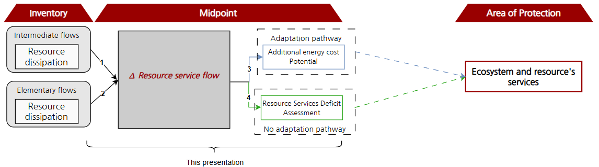

## Resources services loss indicators

Concerned impact categories:
- Resources services loss (midpoint)
- Resources services loss (adaptation) (midpoint)

### 1. Midpoint indicator(s)
The Resources services loss and Resources services loss (adaptation) indicators are sourced from Chapter 6 (starting page 138) of Greffe (2025) 
(https://archipel.uqam.ca/18963/1/D4886.pdf).
The peer-review version of this article is accepted for publication in _The International Journal of Life Cycle 
Assessment_ and will be published soon.

Resource dissipation results in a potential reduction of resource service flow (arrow 1 and 2 on figure 1). 
Since dissipative flows are flows ending in an inaccessible stock to future users, their potential to provide services 
to humans is lost. This latter (negative $\Delta RS$) is identified as a midpoint indicator.
Two distinct and mutually exclusive impact pathways describe the consequences of  a reduction of service flow (arrow 3 
and 4 on figure 1).

<figure>
  
  <figcaption>Figure 1. Impact pathways from resource dissipation to damage on ecosystem services through adaptation and 
respectively non adaptation pathways. The first one addressed by the additional energy cost potential required for 
adaptation (Resources services Loss (adaptation), with blue arrows) and the second one by the resource services deficit 
assessment due to impossible adaptation (Resources Services Loss, with green arrows).</figcaption>
</figure>

For the adaptation pathway (arrow 3 on fig. 1), we develop a characterization method at the midpoint level,
named Resources Loss Services (adaptation) that quantifies an additional energy consumption related to
a dissipative flow at a given moment in time. This indicator can be seen as a measure of the additional
effort required by the society to adapt and keep accessing to resource services. It is quantified by assessing
the additional cumulative energy over time, needed for primary extraction of any combination of resources
needed to compensate the dissipative flow of one specific resource dissipated at a specific point in time. It
is expressed in MJ per kg of dissipative flow.
For the non adaptation pathway (arrow 4 on fig. 1), we develop a second characterization method at
the midpoint level, called Resource Services Loss, which quantifies the potential
cumulative deficit of a given resource (e.g., copper), integrated over time, caused by its dissipation at a
specific point in time.

### 2. Classification method for operationalization
To operationalize both indicators into LCA software platforms, it is necessary to classify elementary flows (first step
of impact assessment as per ISO 14040) i.e. in our case, determine why flows are dissipative and shall be characterized.
As per Greffe (2025), we assume that all emissions of metals to the environment (air, water and soil), either as pure 
element (e.g. Aluminium III ion) or embedded into molecules (e.g. Aluminium hydroxide) are dissipated, including 
long-term emissions. Fossil fuels are considered as dissipated when emitted as either carbon dioxide, fossil; methane, 
fossil or carbon monoxide, fossil to air, as well as microplastics emissions to air, water and soil.
Emissions of radioisotopes, usually reported in kilo-Becquerel, are also classified as dissipative flows and are 
characterized using the radioactive activity of a mass of an element of Kanisch et al. (2022) 
(https://www.bmuv.de/fileadmin/Daten_BMU/Download_PDF/Strahlenschutz/Messanleitungen_2022/aequival_massakt_v2022-03_en_bf.pdf).
For the version 2.2 of IMPACT World+, we make a conservative assumption that emissions to tailings and landfills are 
fully dissipative. However, as we know those emissions are reported as intermediate flows and not elementary flows in 
LCI databases. We have to choose a proxy for those dissipative flows. One can notice that for the majority of 
characterized metals in both indicators (however not all of them), input amount of a metal to landfill or tailing is 
mass-balanced with its long-term emissions of metals to the environment in tailings and landfill LCI dataset in the 
ecoinvent database, as it follows Gabor Doka's models (https://www.doka.ch/home.htm). As a first proxy, we classify 
long-term emissions of metals as dissipative as a proxy of input amount to tailings and landfills. An analysis of 
associated uncertainty to such proxy is being conducted and will be published by 2026.

### 2. Damage indicator(s)
The Resources services loss (adaptation) indicator has no directly associated damage indicators yet.
