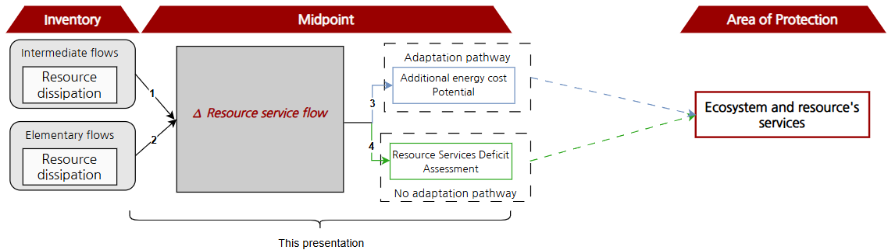

## Resources services loss indicators

Concerned impact categories:
- Adaptation to resources services loss (midpoint)
- Resources services deficit (midpoint)

### 1. Midpoint indicator(s)
The Adaptation to resources services loss and Resources services deficit indicators are sourced from Greffe et al. (2026) [https://doi.org/10.1007/s11367-026-02593-5].

Resource dissipation results in a potential reduction of resource service flow (arrow 1 and 2 on figure 1). 
Since dissipative flows are flows ending in an inaccessible stock to future users, their potential to provide services 
to humans is lost. This latter (negative $\Delta RS$) is identified as a midpoint indicator.
Two distinct and mutually exclusive impact pathways describe the consequences of a reduction of service flow (arrow 3 
and 4 on figure 1).

<figure>
  
  <figcaption>Figure 1. Impact pathways from resource dissipation to damage on ecosystem services through adaptation and 
respectively non adaptation pathways. The first one addressed by the additional energy cost potential required for 
adaptation (Adaptation to resources services loss, with blue arrows) and the second one by the resource services deficit 
assessment due to impossible adaptation (Resources services deficit, with green arrows).</figcaption>
</figure>

For the adaptation pathway (arrow 3 on fig. 1), we develop a characterization method at the midpoint level,
named Adaptation to resources services loss that quantifies an additional energy consumption related to
a dissipative flow at a given moment in time. This indicator can be seen as a measure of the additional
effort required by the society to adapt and keep accessing to resource services. It is quantified by assessing
the additional cumulative energy over time, needed for primary extraction of any combination of resources
needed to compensate the dissipative flow of one specific resource dissipated at a specific point in time. It
is expressed in MJ per kg of dissipative flow.
For the non adaptation pathway (arrow 4 on fig. 1), we develop a second characterization method at
the midpoint level, called Resource services deficit, which quantifies the potential
cumulative deficit of a given resource (e.g., copper), integrated over time, caused by its dissipation at a
specific point in time.

### 2. Classification method for operationalization
To operationalize both indicators into LCA software platforms, it is necessary to classify elementary flows (first step
of impact assessment as per ISO 14040) i.e. in our case, determine why flows are dissipative and shall be characterized.
As per Greffe (2025), we assume that all emissions of metals to the environment (air, water and soil), either as pure 
element (e.g. Aluminium III ion) or embedded into molecules (e.g. Aluminium hydroxide) are dissipated, including 
long-term emissions. Fossil fuels are considered as dissipated when emitted as either carbon dioxide, fossil; methane, 
fossil or carbon monoxide, fossil to air, as well as microplastics emissions to air, water and soil.
Emissions of radioisotopes, usually reported in kilo-Becquerel, are also classified as dissipative flows and are 
characterized using the radioactive activity of a mass of an element of Kanisch et al. (2022) 
(https://www.bmuv.de/fileadmin/Daten_BMU/Download_PDF/Strahlenschutz/Messanleitungen_2022/aequival_massakt_v2022-03_en_bf.pdf).
For the version 2.2 of IMPACT World+, we make a conservative assumption that emissions to tailings and landfills are 
fully dissipative. However, as we know those emissions are reported as intermediate flows and not elementary flows in 
LCI databases. We have to choose a proxy for those dissipative flows. One can notice that for the majority of 
characterized metals in both indicators (however not all of them), input amount of a metal to landfill or tailing is 
mass-balanced with its long-term emissions of metals to the environment in tailings and landfill LCI dataset in the 
ecoinvent database, as it follows Gabor Doka's models (https://www.doka.ch/home.htm). As a first proxy, we classify 
long-term emissions of metals as dissipative as a proxy of input amount to tailings and landfills. An analysis of 
associated uncertainty to such proxy is being conducted and will be published by 2026.

### 3. Characterization of elementary flows in life cycle inventory databases classified as dissipative

We retrieved all substances contained all elementary flows reported in LCI databases, sourced from SimaPro. Since, the composition or the CAS is not consistently reported, we had to find either the CAS or the chemical formula of each substance. Using the name of the substance, we find the Chemical Abstracts Service (CAS) number, which is a unique numerical identifier assigned to a specific chemical substance (e.g., *2269-22-9*), using the *cirpy* and *pubchempy* Python packages. Then, from the CAS number, we look for the chemical formula (e.g., $\text{C}_{12}\text{H}_{27}\text{AlO}_3$) using *cirpy*.

Fossil carbon characterization  
The ACP CF for fossil carbon is calculated as the global fossil fuel dissipation-weighted average of the ACP CFs for these three fossil fuels, according to the following equation:

$$ACP_{C_{\text{fossil}}} = \frac{\sum_{r \in \text{fossil}} D_{r} \cdot ACP_r}{\sum_{r \in \text{fossil}} D_{r} \cdot \theta_{C_{\text{fossil}},r}} = \left[\frac{\text{MJ}}{\text{kg}_{C_{\text{fossil}}}}\right]$$

where:
* $C_{r}$ is the carbon content of the fossil resource $r$, in $\text{kg}_{C_{\text{fossil}}} / \text{kg}_r$.
* $D_{r}$ is the total dissipation of fossil fuel resource $r$ in 2023 in kilograms, reported by the International Energy Agency in the *World Energy Outlook 2024* [IEA, 2024](https://iea.blob.core.windows.net/assets/86ede39e-4436-42d7-ba2a-edf61467e070/WorldEnergyOutlook2023.pdf).  

Then, the characterization factor for a given LCIA indicator $i$ ($i$ being either ACP or RESEDA) is derived as per the following equation:  

$$CF^{i}_{s} = \sum_{e \in s} CF^{i}_{e} \cdot \theta_{e,s}$$  

where $e$ is an element embedded in substance $s$, such as copper, silver, or fossil carbon and $\theta_{e,s}$ is the mass fraction ($\theta_{e,s}$) of each element $e$ in a given substance $s$ is calculated as per Equation 1:

$$\theta_{e,s} = \frac{\alpha_{e,s} \cdot M_e}{\sum_{f \in E} \alpha_{f,s} \cdot M_f}$$

where  $\alpha_{e,s}$ is the number of mole of each element $e$ in substance $s$ and $E$ is the ensemble of all elements in substance $s$. The molar mass $M$ of each element is obtained with the *molmass* Python package.

Dissipative flows of radionuclides  

The emission of one kilo-Becquerel of a radionuclide $r$ (e.g., Cadmium-109) is characterized as per the following equation:  

$$CF_r = \frac{CF_e}{A_r} = \left[\frac{\text{kBq}}{\text{kg}_{r,c}}\right]$$  

where $CF_e$ is the characterization factor of the resource, i.e., Cadmium in the case of Cadmium-109 radionuclide, and $A_r$ is the radioactive activity per unit of mass, i.e., $\text{kBq/kg}$, derived through Equation 3. The activity, in $\text{kBq}$, per kg of radionuclide $r$ is determined following [Kanisch et al. (2022)](https://www.bmuv.de/fileadmin/Daten_BMU/Download_PDF/Strahlenschutz/Messanleitungen_2022/aequival_massakt_v2022-03_en_bf.pdf):  

$$\frac{A_{r}}{m_{r}} = \frac{\lambda_r \cdot N_A}{M_r}$$

where $m_r$ is the mass of isotope in grams, $\lambda_r$ is the decay constant (see Equation 4 below) in $\text{seconds}^{-1}$, $N_A$ is Avogadro's number (equal to $6.022 \times 10^{23} \text{ mol}^{-1}$), and $M_r$ is the molar mass. $M_r$ is obtained with the *molmass* Python package.

All developped ACP and RESEDA CFs are included in the version 2.2.1 of IMPACT World+. A version 2.2.2 will be released soon as an coding error in the characterization of fossil carbon for the ACP indicator was detected in August 2026. The corrected version of the ACP indicator in brightway2 format is available upon request to Titouan Greffe (greffe.titouan@uqam.ca).

A scientific article introducing the operationalization of ACP and RESEDA indicator into LCA software will be submitted soon and will be available as a preprint by the end of 2026.

### 4. Damage indicator(s)
The Resources services loss (adaptation) indicator has no directly associated damage indicators yet.
