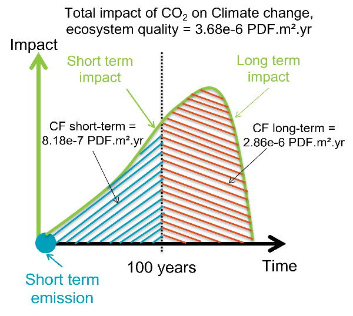
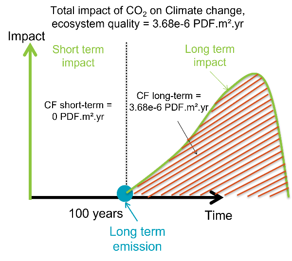

## Long term emissions and time dependent impact categories
With IW+2.0, we properly applied our vision for the relation between short/long-term and short/long-term categories. In 
previous versions, there were some inconsistencies in the implementation of this feature.

In IW+, there are some **_damage_** categories which are split between short and long term impact: Climate change (both human health
and ecosystem quality), freshwater ecotoxicity, human toxicity (both cancer and non cancer) and marine acidification.
For these damage categories, the total impact is split between a short term impact category and a long term one, as shown 
in pictures below.   100 years is the time horizon chosen to differentiate between short and long term impacts.

  

Here we have an emission of carbon dioxide, happening at year 0, i.e., a short-term emission. Most emissions in typical 
LCA databases are short term emissions as they are considered being immediately emitted. The total impact of carbon 
dioxide on climate change, ecosystem quality is 3.68e-6 PDF.m².yr. Of this impact, 8.18e-7 PDF.m².yr will occur in 
the short term impact and 2.86e-6 PDF.m².yr in the long term impact.

Some LCA databases such as ecoinvent also introduced long term emissions. These are identified (in ecoinvent) with
a sub-compartment with "long-term" in its name, such as: "low-population density, long-term". These emissions are thus 
considered occurring more than 100 years after first emissions of the studied life cycle, as shown in the picture below.

  

Now the split of the total impact (3.68e-6PDF.m².yr) cannot be considered as short term impact, because the emission occurs 
after the 100 years time horizon. Therefore, IW+ attributes the overall impact of this emission to the long term impact category.
  In previous versions of IW+, the short term CF was mostly already set to zero, which was correct but the long term 
CF was underestimated. Indeed, the long-term CF for long term emission was equal to the one for short term emission. 
For instance, instead of being 3.68e-6 PDF.m².yr/kg, the previous long term CF for long term CO2 emission was 2.86e-6 PDF.m².yr/kg.

## Toxicity and ecotoxicity - Metal emissions in groundwater
Metal emissions emitted directly to the groundwater sub-compartments are now all properly fixed to zero to be consistent
with the modeling approach for other impact categories and emissions.

## Marine eutrophication - air emissions
All emissions to air and all its sub-compartments are now characterized. For missing sub-compartments,
the value for the unspecified sub-compartment was used.

## Land occupation and transformation update
CF values for land occupation and transformation elementary flows were updated for the following land use: annual crops,
permanent crops and agriculture (mosaic).

## Ionizing radiations
CF values for the midpoint indicator and the human health damage indicator have been updated. New values for the water
compartment and the ocean sub-compartment. Also, new substances have been added: Americium-241, Strontium-90, Thorium-230.

## Water impact categories new elementary flows
CFs for many regionalized elementary flows for the categories: Water scarcity / Water availability, human health / Water availability, 
freshwater ecosystem / Water availability, terrestrial ecosystem, were added for new sub-regions covered in ecoinvent such as CN-AH or
IN-AP. CFs values for these new elementary flows are assumed to be equal to their national CF value, i.e., the CF for 
CN-AH is equal to the CF for CN.

## Detailed changes
For the complete list of changes between previous versions and v2.0 refer to:
- SimaPro_version.xlsx (last available version 1.31-1.49)
- bw2_version.xlsx (last available version 1.30-1.48)
