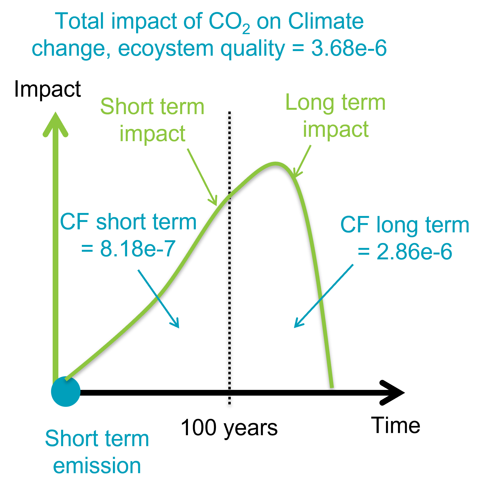
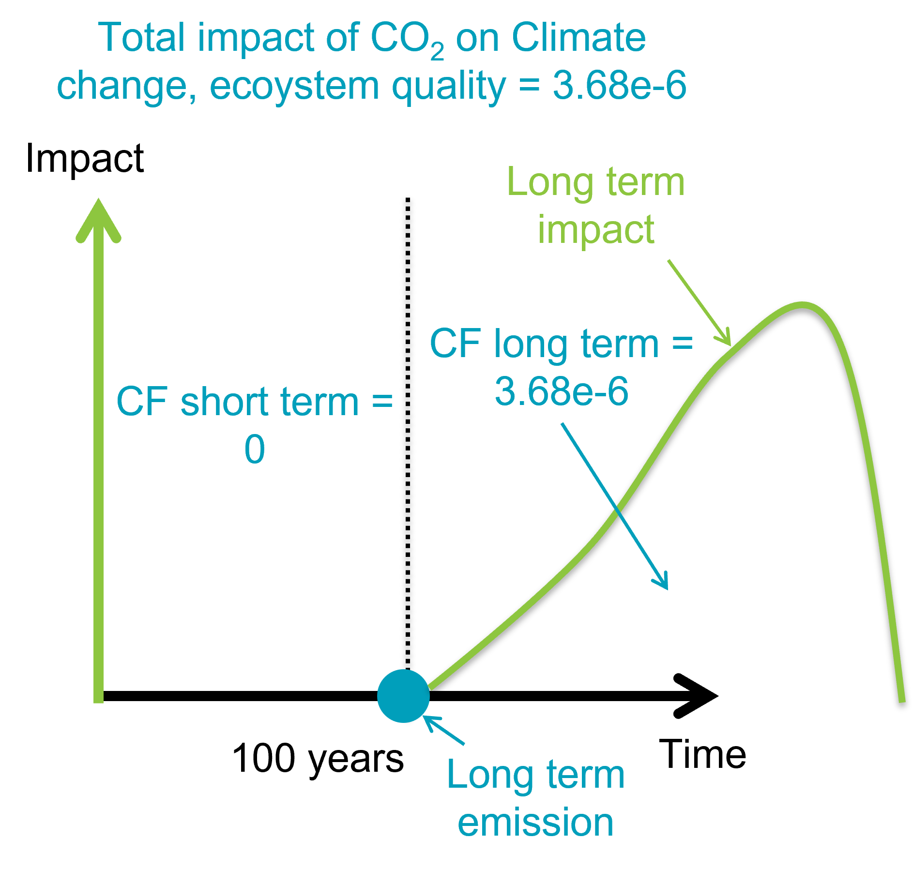

## Long term emissions and impact categories
With IW+2.0, we applied our new vision for the relation between short/long-term emissions/impact categories.

In IW+, there are some damage categories which are split between short and long term: Climate change (both human health
and ecosystem quality), freshwater ecotoxicity, human toxicity (both cancer and non cancer) and marine acidification. 
100 years is the period chosen to differentiate between short and long term. A total impact on one of these damage 
categories is therefore split between the short and long term versions of the damage category as shown in the picture 
below.

Here we have an emission of carbon dioxide, hapening at year 0, i.e., a short term emission. Most emissions in typical 
LCA databases are short term emissions as they are considered being immediatly emitted. The total impact of carbon 
dioxide on climate change, ecosystem quality is 3.68e-6 PDF.m².yr. Of this impact, 8.18e-7 PDF.m².yr is attributed to 
the short term impact and 2.86e-6 PDF.m².yr to the long term impact.

Some LCA databases such as ecoinvent also introduced long term emissions. These are identified (in ecoinvent) with
a sub-compartment with "long-term" in its name, such as: "low-population density, long-term". These emissions are thus 
considered occurring 100 years later such as shown in the picture below.

Now the split of the total impact (3.68e-6PDF.m².yr) cannot occur on the short term impact, because the emission occur 
in 100 years. Therefore, IW+ attributes the totality of the impact to the long term category.
In previous versions of IW+, the short term CF was mostly already set to zero (few exceptions) but the long term CF was
fixed to be equal to the short term impact counterpart, i.e., instead of being 3.68e-6 PDF.m².yr, the previous CF was 
2.86e-6 PDF.m².yr.

## Metal emissions in groundwater
Metal emissions emitted directly to the groundwater sub-compartments were not properly all fixed to zero. Now they all 
are.

## Marine eutrophication - air emissions
Some emissions in the air were not characterized and many sub-compartments were missing. For missing sub-compartments,
the value for the unspecified sub-compartment was used.

## Land occupation and transformation update
Values for the land flows: annual crops, permanent crops and agriculture (mosaic) were updated.

## Water impact categories new flows
Many regionalized flows for water impact categories were added for new sub-regions covered in ecoinvent such as CN-AH or
IN-AP.

## Detailed changes
For the complete list of changes between version 1.31/1.49 and version 2, refer to the file SimaPro_version.xlsx.
